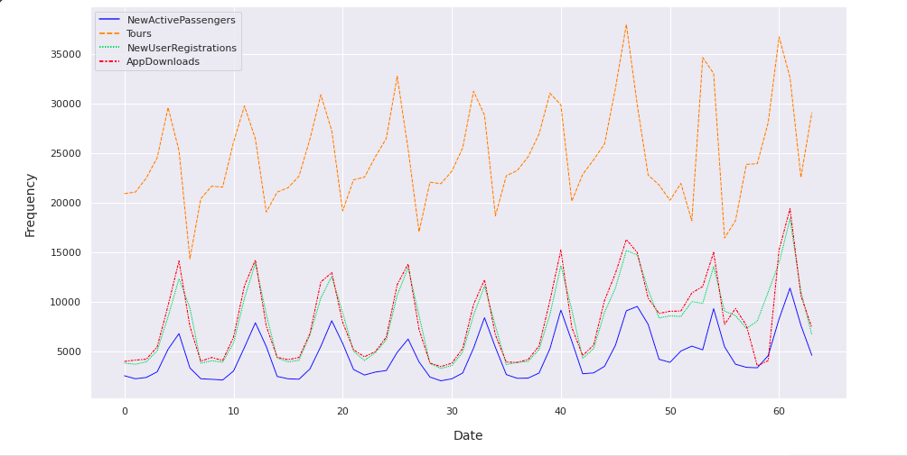
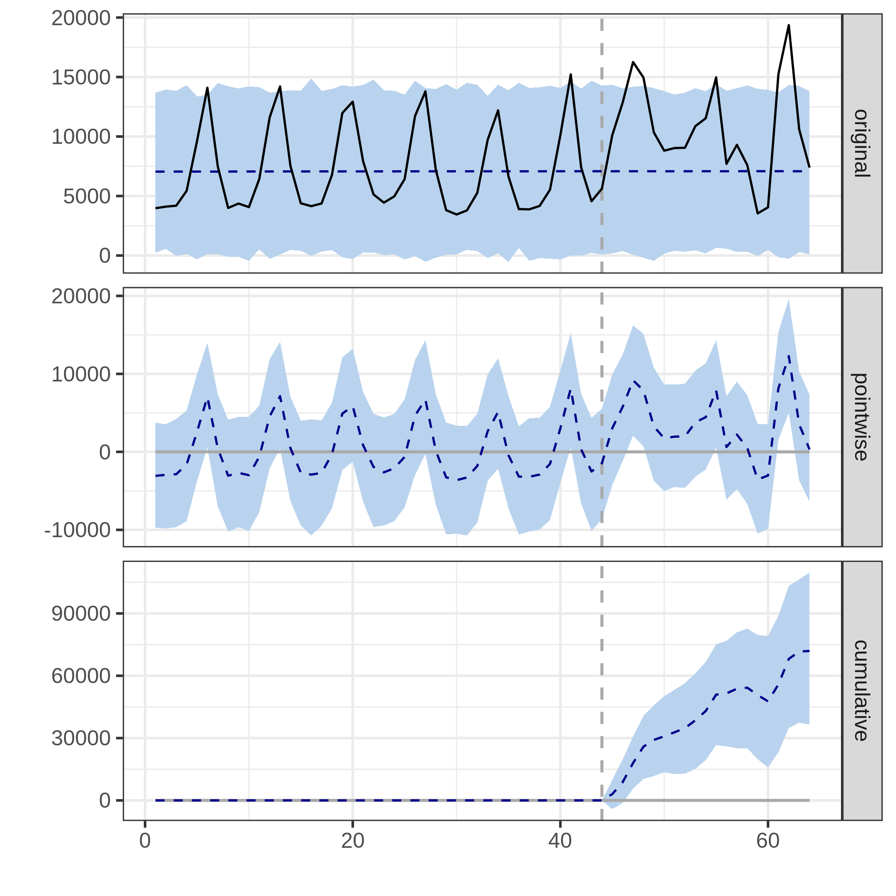

# OOH Analysis

. 

### Introduction 
We are given a dataset of daily campaign data showing various mobile acquisition metrics such downloads, user registrations, activations, and tours. The time period takes place over an approximate 65 day period and it includes daily time series data from before the insertion of the campaign until after its end.

I used Python and Pandas to clean and explore the data, along with Google's R package CausalEffect running in a python environment. 

### Question
How do we understand the impact of an offline campaign? In a digital world of tracking cookies and clicks, how do we measure the impact of hard-to-measure marketing efforts? 

We can use causal inference to understand the effects and determine the effect of the insertion of the campaign and whether it impacted acquisition KPIs. We can fit a model using Bayesian structural time series to make predictions on how acquisition metrics would have performed had the intervention of the TV campaign not taken place. Data is divided into 2 parts: the period before the campaign (pre-period) and the period after the campaign start (post-period). 

### Performance over time

### Difference between the actual series and the predicted series

### Cumulative effect, showing the summation of the point effects accumulated over time

